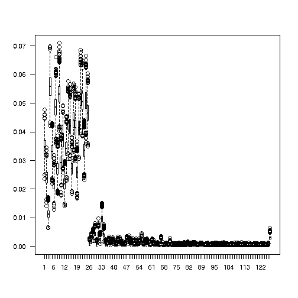
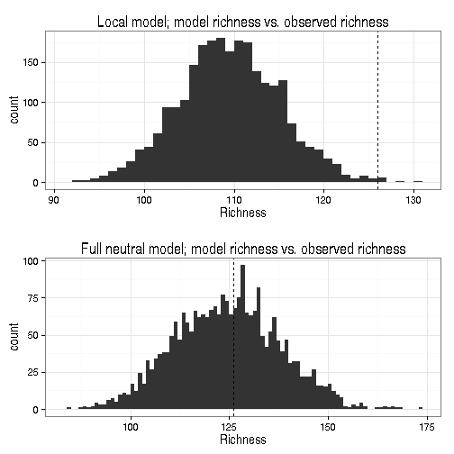

<!--
%\VignetteEngine{knitr}
%\VignetteIndexEntry{An R Markdown Vignette made with knitr}
-->

NMGS - Neutral models for community assembly
===========

## Installing and loading the development version


```r
install.packages("devtools")
library(devtools)
install_github("NMGS", "microbiome", subdir = "R/pkg/")
library(NMGS)
```


## Learning the NMGS model

Carry out the NMGS simulations with the [C
scripts](https://github.com/microbiome/NMGS/tree/master/C). These will
produce the NMGS [output
files](https://github.com/microbiome/NMGS/tree/master/C/output).


### Reading the NMGS outputs

Read the output files in R for further analysis. We assume you have
the C output files in the working directory.


```r
library(NMGS)
samples <- read_nmgs("Simulation_out.csv")
metacommunity <- read_nmgs_metacommunity("Simulation_out_m.csv")  # burnin and thinning already included
stats <- read_nmgs_stats("Simulation_out_s.csv")
```


### Description of the model outputs

_Samples:_ Posterior samples of the model parameters: MCMC samples x
 parameters matrix with the following columns: MCMC sample ID, theta
 (biodiversity parameter), i1...iN immigration rates

_stats:_ Statistics on the sampled communities (after removing burn-in
and parsing the remaining samples; by default, every 10th sample
used); Matrix of selected samples x statistics: 
  * MCMC sampleID: nth sample generated under the neutral model with fitted parameters taken from the corresponding MCMC sample
  * LN, LL, LO: log-likelihoods of the full neutral sample, the local
community sample and the observed sample, respectively;
  * HN, HL, HO: species entropies (ie. Shannon diversity; neutral, local, observed)
  * SN, SL, SO: species richnesses (neutral, local, observed)

_metacommunity:_ A list with N, p, q. Gives the generated
 metacommunities: SampleN, SL, SN; p1,...,pSL; q1,...,qSN. The N is a
 matrix with MCMC sample ID, SL (species richness in the local
 assembly sample; always constant), SN (species richness in the sample
 generated under the full neutral model); p is the metacommunity
 distribution for the local assembly sample (matrix of MCMC samples x
 SL); q is the metacommunity distribution under the full neutral model
 (a list with elements with varying length SN, each corresponding to
 one MCMC sample).


## Analyzing the NMGS outputs

### Summarizing posterior samples

Posterior summaries:


```r
summaries <- nmgs_posterior_summaries(samples, burnin = 25000, thinning = 10)
```

```
## Error: could not find function "nmgs_posterior_summaries"
```

```r
head(summaries)
```

```
## Error: object 'summaries' not found
```


Visualize posterior of a given parameter (excluding burn-in and
thinning the samples):


```r
# Define burn-in, thinning and parameter to follow
burnin <- 25000  # Leave out this many samples from the start
thinning <- 10  # Take every kth samples
param <- "theta"  # or one of the migration rates i1...iN

p <- ggplot(data.frame(x = samples[seq(burnin + 1, nrow(samples), thinning), 
    param]), aes(x = x))
```

```
## Error: could not find function "ggplot"
```

```r
p <- p + geom_density() + xlab(param)
```

```
## Error: object 'p' not found
```

```r
p <- p + ggtitle(paste(param, "histogram"))
```

```
## Error: object 'p' not found
```

```r
print(p)
```

```
## Error: object 'p' not found
```


Follow the convergence of a given parameter. The vertical line indicates the burn-in point:


```r
thinning <- 200  # Take every kth samples
s <- seq(1, nrow(samples), thinning)
plot(s, samples[s, param], type = "l", main = paste(param, "convergence"))
abline(v = burnin)
```

 


### Metacommunity

Metacommunity distribution with the local assembly model


```r
boxplot(metacommunity$p, las = 1)
```

 


Metacommunity averages:


```r
print(nmgs_metapopulation_average(metacommunity)$local)
```

```
##   [1] 0.0347458 0.0239980 0.0113415 0.0558154 0.0330752 0.0217902 0.0487197
##   [8] 0.0272092 0.0533554 0.0293637 0.0371854 0.0218708 0.0342013 0.0433238
##  [15] 0.0421186 0.0272166 0.0441229 0.0415109 0.0259772 0.0414386 0.0520751
##  [22] 0.0505479 0.0335348 0.0510489 0.0466658 0.0010942 0.0022312 0.0031043
##  [29] 0.0044216 0.0008509 0.0043333 0.0024925 0.0096614 0.0039874 0.0007124
##  [36] 0.0004227 0.0010531 0.0008568 0.0011608 0.0005665 0.0002745 0.0010882
##  [43] 0.0011955 0.0004347 0.0002802 0.0002851 0.0015172 0.0011871 0.0007507
##  [50] 0.0008831 0.0002929 0.0007395 0.0004119 0.0009948 0.0018817 0.0002762
##  [57] 0.0007216 0.0008666 0.0005673 0.0001367 0.0010618 0.0002776 0.0002745
##  [64] 0.0002735 0.0001350 0.0014793 0.0001346 0.0001394 0.0002763 0.0001349
##  [71] 0.0007240 0.0001352 0.0001378 0.0001405 0.0001378 0.0001371 0.0001355
##  [78] 0.0001340 0.0001444 0.0001342 0.0002860 0.0001367 0.0001403 0.0002826
##  [85] 0.0002737 0.0001335 0.0001374 0.0002759 0.0002730 0.0001367 0.0001419
##  [92] 0.0001334 0.0001330 0.0001414 0.0001292 0.0001386 0.0001384 0.0001342
##  [99] 0.0001366 0.0001365 0.0001313 0.0001351 0.0001364 0.0001383 0.0001343
## [106] 0.0001365 0.0001332 0.0001347 0.0001350 0.0001348 0.0001340 0.0001323
## [113] 0.0001320 0.0001345 0.0001342 0.0001370 0.0001318 0.0001334 0.0001363
## [120] 0.0001349 0.0001337 0.0001344 0.0001364 0.0001348 0.0001314 0.0001383
## [127] 0.0029269
```


_Metacommunity distribution for the full neutral model (q) - are the species
indices directly comparable, or how to combine across MCMC samples?_


### Local communities

Generated local communities are not currently available from the
output files but we can compare diversity distributions across MCMC
models w.r.t. observed data. The vertical line indicates diversity in
the observed data.


```r
library(ggplot2)
theme_set(theme_bw(15))

full <- qplot(stats$HN, binwidth = 0.1, geom = "histogram") + geom_vline(x = unique(stats$HO), 
    linetype = 2)
full <- full + ggtitle("Full neutral model; model diversity vs. observed diversity")
full <- full + xlab("Diversity")

local <- qplot(stats$HL, binwidth = 0.1, geom = "histogram") + geom_vline(x = unique(stats$HO), 
    linetype = 2)
local <- local + ggtitle("Local model; model diversity vs. observed diversity")
local <- local + xlab("Diversity")

library(gridExtra)
grid.arrange(local, full, nrow = 2)
```

 


Richnesses in MCMC simulations (histogram) and observed data (vertical
dashed line):


```r
full <- qplot(stats$SN, binwidth = 1, geom = "histogram") + geom_vline(x = unique(stats$SO), 
    linetype = 2)
full <- full + ggtitle("Full neutral model; model richness vs. observed richness")
full <- full + xlab("Richness")

local <- qplot(stats$SL, binwidth = 1, geom = "histogram") + geom_vline(x = unique(stats$SO), 
    linetype = 2)
local <- local + ggtitle("Local model; model richness vs. observed richness")
local <- local + xlab("Richness")

grid.arrange(local, full, nrow = 2)
```

 


Add here the similar histogram for the likelihoods

### Testing neutrality

Neutrality under the full neutral model and the local assembly
model. Compares the log-likelihood under the full neutral model to the
observed data:


```r
print(nmgs_neutrality(stats, "full"))
```

```
## Error: undefined columns selected
```

```r
print(nmgs_neutrality(stats, "local"))
```

```
## Error: undefined columns selected
```


### Licensing and Citations

This work can be freely used, modified and distributed under the [GNU
General Public GPL>=2
license](https://en.wikipedia.org/wiki/GNU_General_Public_License).

Kindly cite the work, if appropriate, as 'Leo Lahti, Christoper Quince
et al. (2013). NMGS R package. URL:
https://github.com/microbiome/NMGS)'.


### Session info

This vignette was created with


```r
sessionInfo()
```

```
## R version 3.0.1 (2013-05-16)
## Platform: x86_64-unknown-linux-gnu (64-bit)
## 
## locale:
##  [1] LC_CTYPE=en_US.UTF-8       LC_NUMERIC=C              
##  [3] LC_TIME=en_US.UTF-8        LC_COLLATE=en_US.UTF-8    
##  [5] LC_MONETARY=en_US.UTF-8    LC_MESSAGES=en_US.UTF-8   
##  [7] LC_PAPER=C                 LC_NAME=C                 
##  [9] LC_ADDRESS=C               LC_TELEPHONE=C            
## [11] LC_MEASUREMENT=en_US.UTF-8 LC_IDENTIFICATION=C       
## 
## attached base packages:
## [1] grid      stats     graphics  grDevices utils     datasets  methods  
## [8] base     
## 
## other attached packages:
## [1] gridExtra_0.9.1 ggplot2_0.9.3.1 NMGS_0.1.02     knitr_1.2      
## 
## loaded via a namespace (and not attached):
##  [1] colorspace_1.2-2   dichromat_2.0-0    digest_0.6.3      
##  [4] evaluate_0.4.3     formatR_0.7        gtable_0.1.2      
##  [7] labeling_0.1       MASS_7.3-26        munsell_0.4       
## [10] plyr_1.8           proto_0.3-10       RColorBrewer_1.0-5
## [13] reshape2_1.2.2     scales_0.2.3       stringr_0.6.2     
## [16] tools_3.0.1
```


